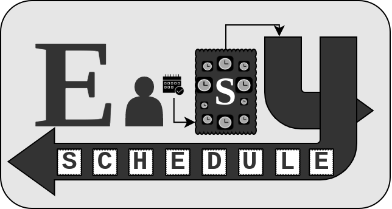

<h3>An asynchronus scheduler for python tasks, which uses Cron schedules for precise scheduling recurring tasks</h3>

[](https://easyschedule.readthedocs.io/en/latest/?badge=latest) [](https://pypi.org/project/easyschedule/)
#

## Documenation
[https://easyschedule.readthedocs.io/en/latest/](https://easyschedule.readthedocs.io/en/latest/)

## Get Started
```bash
pip install easyschedule
```

```python
import asyncio
from easyschedule import EasyScheduler

scheduler = EasyScheduler()

default_args = {'args': [1, 2, 3]}
weekday_every_minute = '* * * * MON-FRI'

@scheduler(schedule=weekday_every_minute, default_args=default_args)
def weekday_stuff(a, b, c):
    print(f"a {a} b: {b} c {c}")

@scheduler.delayed_start(delay_in_seconds=30)
async def delay_startup():
    print(f"## startup task - started ##")
    await asyncio.sleep(10)
    print(f"## startup task - ended ##")

@scheduler.shutdown()
async def shutdown():
    print(f"## shutdown task - started ##")
    await asyncio.sleep(10)
    print(f"## shutdown task - ended ##")

@scheduler.once(date_string='2022-03-12 16:18:03')
async def next_year():
    print(f"That was a long year")

async def main():
    # start scheduler
    sched = asyncio.create_task(scheduler.start())
    await asyncio.sleep(10)

    # dynamicly schedule task
    wk_end_args = {'kwargs': {'count': 5}}
    weekend = '30 17-23,0-5 * * SAT,SUN'

    def weekend_stuff(count: int):
        for _ in range(count):
            weekday_stuff(3,4,5)
            weekday_stuff(5,6,7)

    scheduler.schedule(
        weekend_stuff, 
        schedule=weekend,
        default_args=wk_end_args
    )
    await sched

asyncio.run(main())
```
```bash
03-13 09:09:25 EasyScheduler WARNING  weekday_stuff next_run_time: 2021-03-15 00:01:00.143645
03-13 09:09:25 EasyScheduler WARNING  single task delay_startup scheduled to run at 2021-03-13 09:09:55.143337 in 30.0 s
03-13 09:09:25 EasyScheduler WARNING  single task next_year scheduled to run at 2022-03-12 16:18:03 in 31475317.856636 s
03-13 09:09:35 EasyScheduler WARNING  weekend_stuff next_run_time: 2021-03-13 17:31:00.152428
03-13 09:09:48 EasyScheduler WARNING  shutdown task shutdown triggered at 2021-03-13 09:09:48.937516
## shutdown task - started ##
## shutdown task - ended ##
Traceback (most recent call last):
  File "test.py", line 50, in <module>
    asyncio.run(main())
KeyboardInterrupt
```
## Cron syntax Compatability

EasySchedule is capable of parsing most cron schedule syntax

#
## Monthly
First of month at 11:00 PM
```bash
0 23 1 * *
```
#

## Daily
Every 2 Hours
```bash
0 */2 * *
```
#

## Weekends Only 
Every Hour Between 5:30 PM  - 5:30 AM ##
```bash
30 17-23,0-5 * * SAT,SUN
```
## Cron Generator
An easy & interactive way to build a cron schedule is available via <em>[crontab.guru](https://crontab.guru/) </em>

### Note: unsupported syntax (currently)
```bash
@(non-standard) 
@hourly
@daily 
@anually
```

#
## Scheduluing Single Tasks
EasySchedule is complete with single task scheduling

### Usage with 'once' decorator
```python
from datetime import datetime, timedelta

next_year = datetime.now() + timedelta(days=365)

@scheduler.once(date=next_year)
async def future_task():
    ## future work
    pass

# current month: 2021-03-13 00:00:00
@scheduler.once(date_string='2021-04-13 00:00:00')
async def run_at_date():
    ## future work
    pass

# current month: 2021-03-13 00:00:00
@scheduler.once(delta=timedelta(days=3))
async def run_after_delta():
    ## future work
    pass

now_args={'kwargs': {'work': "Lots of work"}}

@scheduler.once(now=True, default_args=now_args)
async def run_now(work):
    ## future work
    print(f"starting {work}")
    pass
```
#
## Schedule a task at or near application startup
```python
notify = {
    'kwargs': { 'emails': ['admin@company.org'] }
    }

@scheduler.delayed_start(delay_in_seconds=30, default_args=notify)
async def notify_online(emails: str):
    message = f"server is operational"
    await send_emails(message, emails)
    #something else

async def get_data():
    return await requests.get('http://data-source')

@scheduler.startup()
async def update_database():
    data = await get_data()
    await db.update(data)
    #something else
```
#
## Schedule a task to run at application shutdown
```python
notify = {
    'kwargs': { 'emails': ['admin@company.org'] }
    }

@scheduler.shutdown(default_args=notify)
async def notify_shutdown(emails: str):
    message = f"server is shutting down"
    await send_emails(message, emails)
    #something else?
```